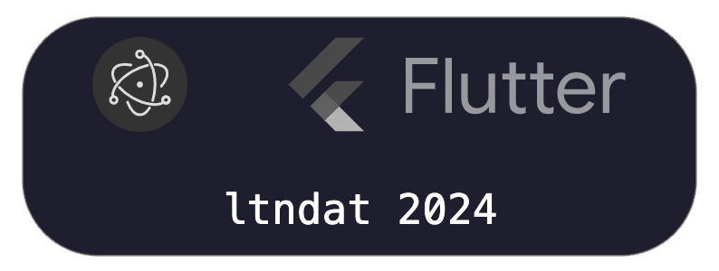

Hi there 👋

I am currently working as a full-stack app developer.

Here are my favorite technologies, sorted by interest:

- **Programming Languages:** JavaScript, TypeScript, Python, Dart, Kotlin
- **Backend Frameworks:** Express (TypeScript), Spring (Kotlin), Flask (Python)
- **Frontend Frameworks:** React (TypeScript), Vue (TypeScript)
- **App Frameworks:** Electron (TypeScript), Flutter (Dart)
- **Database Engines:** MongoDB, SQLite, PostgreSQL, MySQL

> I'm a big fan of Electron (TypeScript) and Flutter (Dart).

<!-- 

<h3 style="color:white;text-align:center;font-family:monospace;font-weight:200;margin:16px 0 0">ltndat 2024</h3>

 -->

